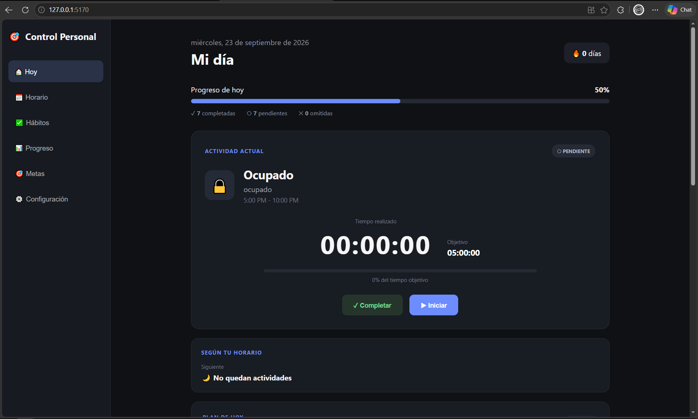
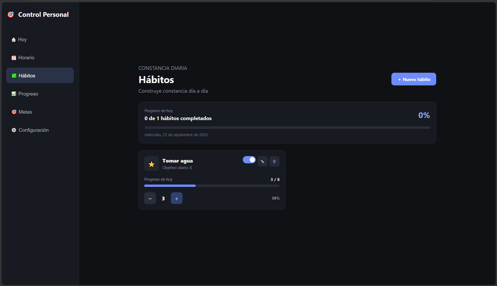
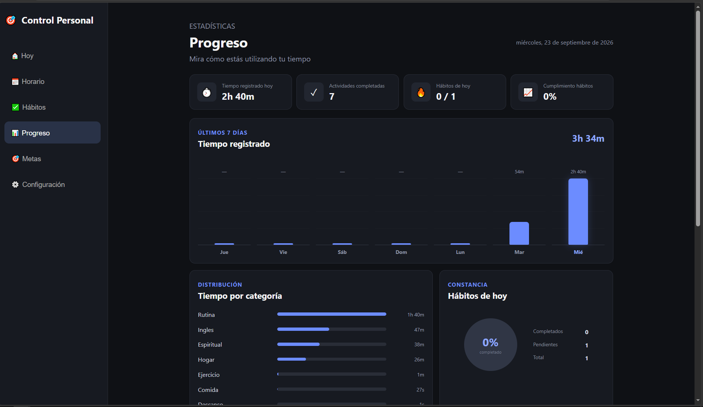
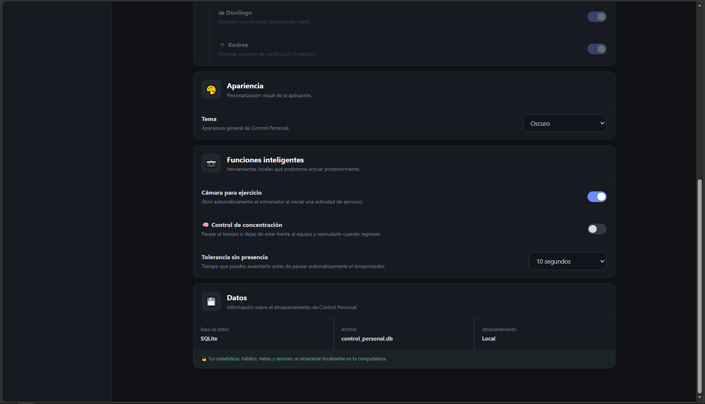
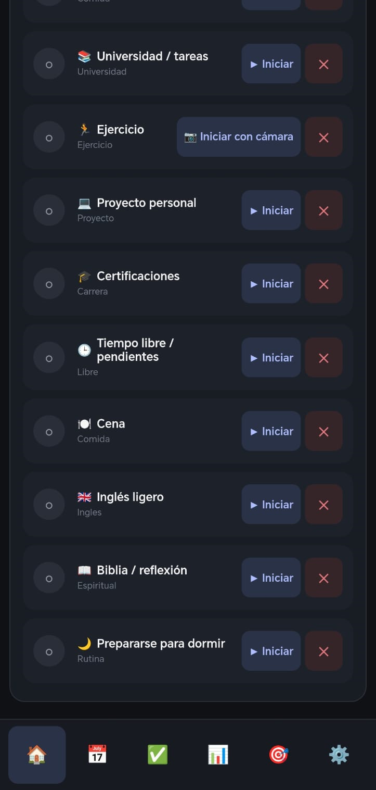
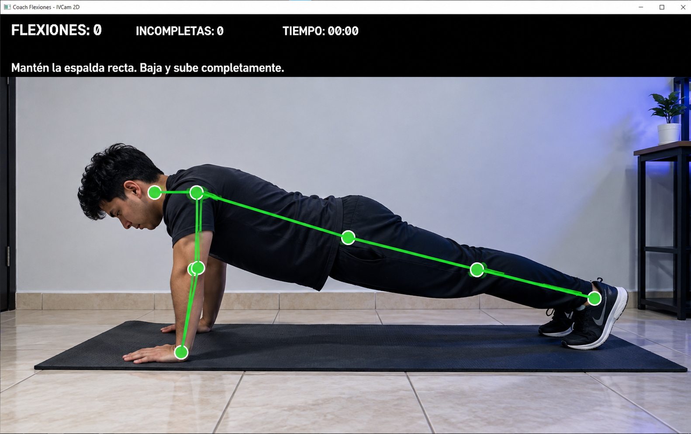

# Control Personal

**Control Personal** es una aplicación de escritorio orientada a la organización personal, seguimiento de actividades, productividad y hábitos.

El sistema fue desarrollado principalmente con **Python, Flask y SQLite**, utilizando una interfaz web local y herramientas de monitoreo para Windows. También incorpora visión por computadora para funciones de concentración y seguimiento de ejercicios.

## Características principales

- Seguimiento de actividades mediante temporizadores.
- Organización de actividades por horarios.
- Gestión y seguimiento de metas.
- Seguimiento de hábitos.
- Registro de sesiones y progreso.
- Detección de la aplicación o ventana activa en Windows.
- Detección de inactividad.
- Detección de aplicaciones y sitios distractores.
- Integración con Android mediante una API HTTP local.
- Monitoreo de concentración mediante cámara.
- Entrenador de flexiones mediante visión por computadora.
- Compatibilidad con cámaras locales e IVCam.
- Base de datos local con SQLite.
- Interfaz accesible desde el navegador.
- Inicio automático opcional con Windows.

## Tecnologías utilizadas

### Backend
- Python
- Flask
- SQLite

### Interfaz
- HTML5
- CSS3
- JavaScript

### Windows
- PyWin32
- psutil

### Visión por computadora
- OpenCV
- MediaPipe
- NumPy

### Android
- Kotlin
- API HTTP local

### Distribución
- PyInstaller
- Inno Setup

## Arquitectura

Control Personal utiliza Flask como servidor local.

```text
Control Personal
       │
       ├── Flask
       │     │
       │     ├── SQLite
       │     ├── Monitor de actividad
       │     ├── Monitor de concentración
       │     ├── Monitor de distracciones
       │     └── Comunicación con Android
       │
       ├── Interfaz Web
       │     ├── HTML
       │     ├── CSS
       │     └── JavaScript
       │
       ├── Detector de concentración
       │     ├── OpenCV
       │     └── MediaPipe
       │
       └── Entrenador de flexiones
             ├── OpenCV
             └── MediaPipe
```

## Capturas de pantalla

### Panel principal



### Metas y hábitos



### Seguimiento del progreso



### Ajustes



### Vision por telefono



### Panel de control ejercicio



## Instalación

La forma recomendada de utilizar Control Personal es mediante el instalador disponible en **Releases**.

1. Descarga `Control-Personal-Setup-v1.0.0.exe`.
2. Ejecuta el instalador.
3. Completa el asistente de instalación.
4. Ejecuta **Control Personal**.
5. La aplicación iniciará el servidor local y abrirá automáticamente la interfaz en el navegador.

La interfaz principal se abre en:

```text
http://127.0.0.1:5170/
```

## Datos del usuario

La información personal no se almacena dentro de la carpeta de instalación.

En Windows se guarda en:

```text
%LOCALAPPDATA%\ControlPersonal\
```

La base de datos principal se encuentra en:

```text
%LOCALAPPDATA%\ControlPersonal\database\control_personal.db
```

Esto permite actualizar o reinstalar la aplicación sin depender de los archivos ubicados en `Program Files`.

## Ejecución desde el código fuente

Clona el repositorio:

```bash
git clone https://github.com/LordFix410/Control-Personal.git
```

Entra al proyecto:

```bash
cd Control-Personal
```

Crea un entorno virtual:

```bash
python -m venv venv
```

En Windows:

```bat
venv\Scripts\activate
```

Instala las dependencias del proyecto y ejecuta:

```bat
python app.py
```

La aplicación abrirá automáticamente:

```text
http://127.0.0.1:5170/
```

## Integración con Android

Control Personal dispone de integración con Android para complementar el seguimiento de actividad del usuario.

La comunicación se realiza mediante una **API HTTP dentro de la red local**.

> Actualmente algunas configuraciones de conexión pueden requerir adaptación a la dirección IP del equipo que ejecuta el servidor.

## Detección mediante cámara

El proyecto incluye dos componentes independientes:

### Detector de concentración

Utiliza **OpenCV y MediaPipe** para determinar presencia frente a la cámara durante determinadas actividades.

### Entrenador de flexiones

Utiliza visión por computadora para realizar seguimiento del ejercicio y registrar información de la sesión.

El detector puede utilizar **IVCam** cuando está disponible y recurrir a una cámara local como alternativa.

## Privacidad

Control Personal está diseñado para trabajar principalmente de forma local.

Los registros de actividades y progreso se almacenan en una base de datos SQLite en el equipo del usuario.

## Mejoras futuras

- Selector de cámara desde la interfaz.
- Selección entre IVCam, webcam y ejecución sin cámara.
- Configuración más sencilla de la comunicación con Android.
- Mejorar la detección automática del servidor dentro de la red local.
- Ampliar estadísticas y reportes.
- Mejorar el sistema de configuración y personalización.

## Versión

**Control Personal v1.0.0**

Primera versión distribuible del proyecto para Windows.

## Autor

**Jair Abdiel Carcúz López**

Ingeniería en Sistemas | Desarrollo de Software | Infraestructura TI | Automatización

GitHub: **LordFix410**

---

Proyecto desarrollado como parte de mi portafolio personal de software.
